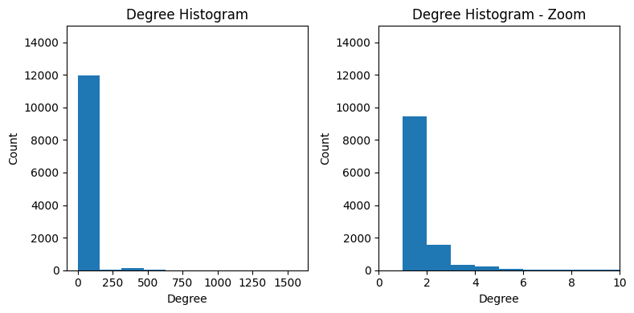
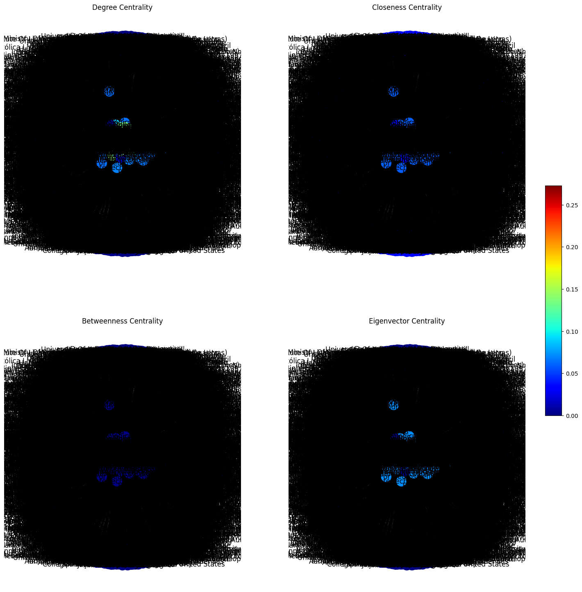
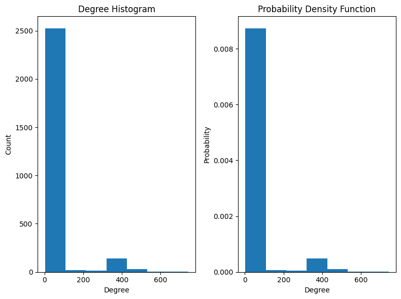
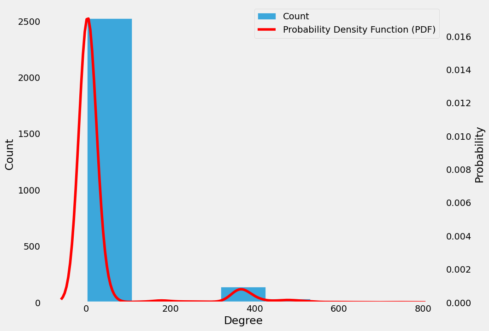
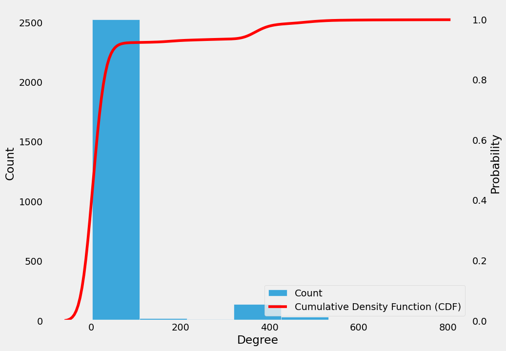
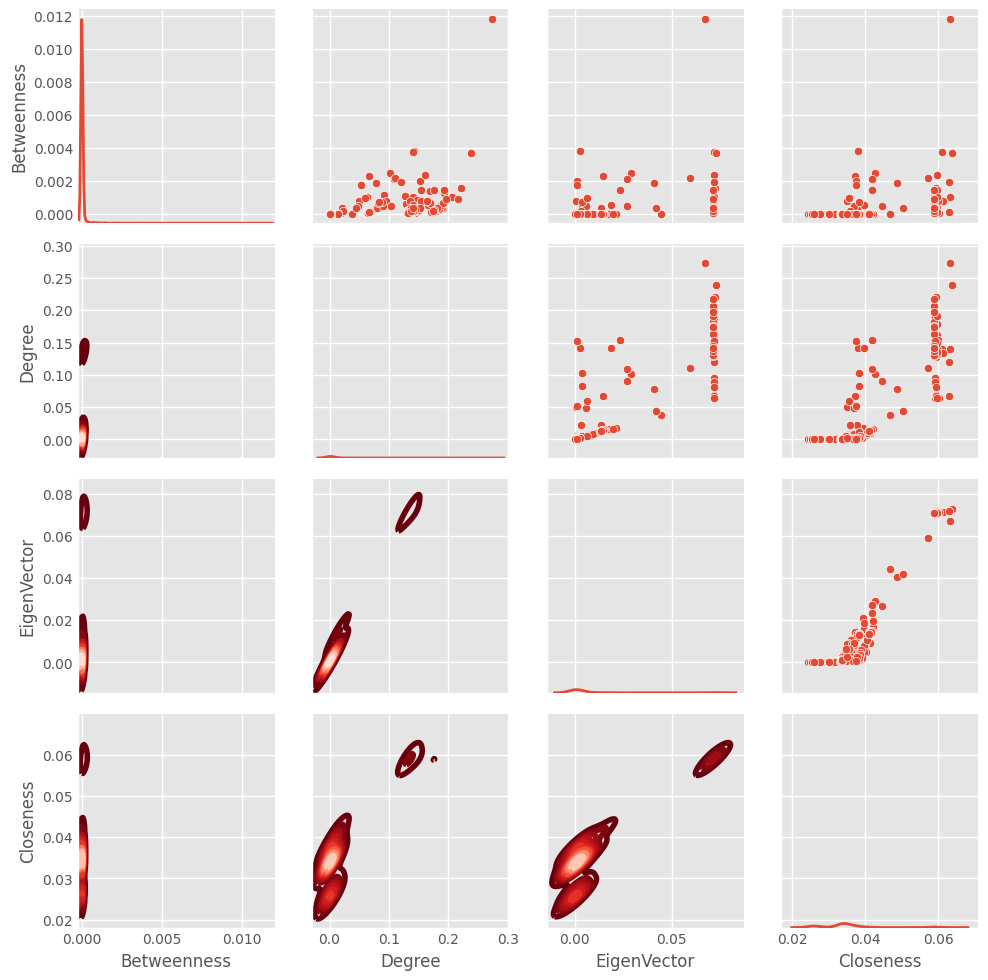
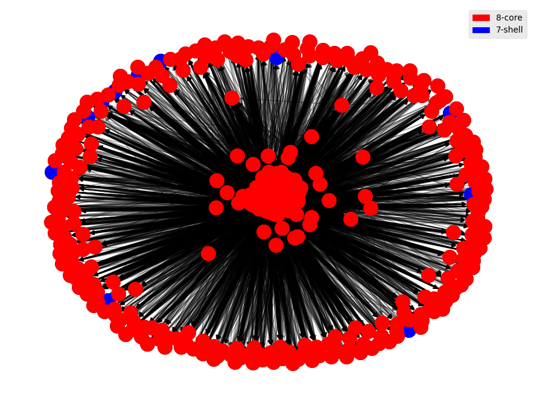

UNIVERSIDADE FEDERAL DO RIO GRANDE DO NORTE - UFRN

DCA0209 - ALGORITMOS E ESTRUTURA DE DADOS II

Trabalho 03 - Unidade 02

Componentes do grupo:

* Francisco Daniel Davi
* Luiz Henrique Araújo Dantas

Neste repositório estaremos abordando uma prática realizada na disciplina de Algoritmos e Estrutura de Dados II (DCA0209), disciplina do Curso de Engenharia de Computação da Universidade Federal do Rio Grande do Norte, por orientação do professor Ivanovitch Medeiros Dantas da Silva.

## Wikipedia

Nesta tarefa, vamos utilizar uma página do Wikipedia para que possamos realizar uma série de análises sobre o conteúdo da página escolhida. Nosso tema foi escolhido como nossa instituição de ensino, a Universidade Federal do Rio Grande do Norte.

Para isso, buscamos primeiramente qual o link responsável por nos direcionar para a página na Wikipedia em língua inglesa, que é este [link](https://en.wikipedia.org/wiki/Federal_University_of_Rio_Grande_do_Norte). Neste link há informações gerais sobre nossa instituição e iremos utilizá-las para nossas análises.


## Bibliotecas utilizadas

Para desenvolver esse projeto tivemos o auxílio das seguintes bibliotecas:

~~~python
from operator import itemgetter
import networkx as nx
import wikipedia
import matplotlib.pyplot as plt
import matplotlib.patches as mpatches
import numpy as np
import seaborn as sns
import pandas as pd
~~~

A partir delas podemos construir nossa análise, em especial a biblioteca do Wikipedia (é necessário realizar a instalação) e do Networkx (versão 2.6.3). Com as bibliotecas prontas, podemos dar prosseguimento à próxima etapa.

## Criando o primeiro grafo

Para criar o grafo utilizamos o título da página como seed e diversos identificadores para referenciar os nós folha, como mostra o código abaixo.

~~~python
#https://en.wikipedia.org/wiki/Federal_University_of_Rio_Grande_do_Norte
SEED = "Federal University of Rio Grande do Norte".title()
STOPS = ("International Standard Name Identifier",
         "Viaf (Identifier)",
         "Isni (Identifier)",
         "Isbn (Identifier)",
         "Education in Rio Grande do Norte",
         "Federal universities of Brazil",
         "University")
~~~

Em seguida temos que construir os conjuntos onde serão armazenadas as informações que serão baixadas do Wikipedia.

~~~python
todo_lst = [(0, SEED)] # The SEED is in the layer 0
todo_set = set(SEED) # The SEED itself
done_set = set() # Nothing is done yet
~~~

Com isso, para realizar o download dos conteúdos da página utilizamos o seguinte código, que é responsável por fazer a busca da página e realizar o download dos conteúdos. Ele também irá popular as listas e conjuntos criados anteriormente.

~~~python

%%time
while layer < 2:
  # Remove the name page of the current page from the todo_lst, 
  # and add it to the set of processed pages. 
  # If the script encounters this page again, it will skip over it.
  del todo_lst[0]
  done_set.add(page)
  
  # Show progress
  print(layer, page) 
  
  # Attempt to download the selected page.
  try:
    wiki = wikipedia.page(page)
  except:
    print("Could not load", page)
    layer, page = todo_lst[0]
    continue
  
  for link in wiki.links:
    link = link.title()
    if link not in STOPS and not link.startswith("List Of"):
      if link not in todo_set and link not in done_set:
        todo_lst.append((layer + 1, link))
        todo_set.add(link)
      g.add_edge(page, link)
  layer, page = todo_lst[0]
~~~

Realizado o download do conteúdo, podemos verificar a quantidade de nós e conexões que existem no conteúdo baixado.

``` 12252 nodes, 53703 edges ```

Com isso podemos partir com a próxima etapa, que consiste em realizar o pré-processamento das informações que foram baixadas e realizar uma "limpeza" nos conteúdos repetidos e que estejam de certa forma, impróprios para uso quando formos montar o nosso grafo com as métricas de centralidade de grau, proximidade, intermediação e autovetores.


Para remover as duplicatas existentes no nosso conjunto de dados utilizamos o seguinte código:

~~~python
# remove self loops
g.remove_edges_from(nx.selfloop_edges(g))

# identify duplicates like that: 'network' and 'networks'
duplicates = [(node, node + "s") 
              for node in g if node + "s" in g
             ]

for dup in duplicates:
  # *dup is a technique named 'unpacking'
  g = nx.contracted_nodes(g, *dup, self_loops=False)

print(duplicates)

duplicates = [(x, y) for x, y in 
              [(node, node.replace("-", " ")) for node in g]
                if x != y and y in g]
print(duplicates)

for dup in duplicates:
  g = nx.contracted_nodes(g, *dup, self_loops=False)

# nx.contracted creates a new node/edge attribute called contraction
# the value of the attribute is a dictionary, but GraphML
# does not support dictionary attributes
nx.set_node_attributes(g, 0,"contraction")
nx.set_edge_attributes(g, 0,"contraction")
~~~


Com isso, podemos ver que há um novo valor para os nós e conexões existentes no nosso dataset.

``` 
12188 nodes, 53661 edges
```

A partir dessa limpeza, podemos plotar o nosso primeiro histograma para verificar onde há a maior concentração de graus dos nós, conforme mostra na imagem abaixo, há uma grande concentração de nós que possuem o grau com valor 1, com isso iremos filtrar todos os nós para que sejam mantidos somente os que possuam grau acima de 2.



Dando prosseguimento, fazemos a filtragem de acordo com o código:

~~~python
# filter nodes with degree greater than or equal to 2
core = [node for node, deg in dict(g.degree()).items() if deg >= 2]

# select a subgraph with 'core' nodes
gsub = nx.subgraph(g, core)

print("{} nodes, {} edges".format(len(gsub), nx.number_of_edges(gsub)))

nx.write_graphml(gsub, "cna.graphml")
~~~

O resultado dessa filtragem é mostrada em porcentagem com os nós e conexões removidas:

```
Nodes removed: 77.62%
Edges removed: 17.63%
Edges per nodes: 16.20
```

## Capturando os nós mais importantes do grafo

Para listar os nós que possuem maior importância dentro do nosso grafo, utilizamos o seguinte código, esses nós são os que possuirão maior coloração e maior número de conexões entre nós, tornando-os mais aproximados ao centro do nosso grafo.

~~~python
top_indegree = sorted(dict(gsub.in_degree()).items(),
                      reverse=True, key=itemgetter(1))[:100]
print("\n".join(map(lambda t: "{} {}".format(*reversed(t)), top_indegree)))
~~~

Tendo todos os nós mais importantes listados e organizados, iremos realizar a plotagem do gráfico com as quatro métricas de centralidade: a centralidade de grau, proximidade, intermediação e autovetores.
> _Nesta etapa houve um problema no nosso dataset que não sabemos como resolver, as palavras relacionadas ofuscaram o nosso grafo, de forma que não podemos ver quais são os nós de maior importância ao centro._



Dado esse resultado, iremos agora explorar as distribuições de centralidade, utilizando a PDF e a CDF.

## Distribuições de centralidade: PDF e CDF

Para realizar o plot da PDF, utilizamos o seguinte código:

~~~python
plt.style.use("default")
# degree sequence
degree_sequence = sorted([d for n, d in gsub.degree()], reverse=True)  

fig, ax = plt.subplots(1,2,figsize=(8,6))

# all_data has information about degree_sequence and the width of each bin
all_data = ax[0].hist(degree_sequence,bins=7)
ax[1].hist(degree_sequence,bins=7,density=True)

ax[0].set_title("Degree Histogram")
ax[0].set_ylabel("Count")
ax[0].set_xlabel("Degree")

ax[1].set_title("Probability Density Function")
ax[1].set_ylabel("Probability")
ax[1].set_xlabel("Degree")

plt.tight_layout()
plt.show()
~~~

Com ele podemos obter a comparação entre o histograma de graus e a função densidade de probabilidade, mostrada no gráfico abaixo:



Com isso, podemos plotar a curva da PDF a partir do código de plotagem da PDF, presente no notebook, o resultado obtido é:



E, para a métrica de CDF, que corresponde à Cumulative Density Function, onde mostra a porcentagem de nós que cada grau possui em relação às conexões da rede, obtemos o seguinte gráfico:



Nesse gráfico podemos ver que os graus dos nós estão entre a probabilidade de 0.9, ou 90%, e com uma quantidade de 2000 a 2500, onde mostra o predomínio dos nós entre os graus 0 e 100.


Em seguida, plotamos o gráfico que mostra, em sua diagonal principal, as PDF's do nosso dataset, em sua matriz superior os gráficos do tipo Scatter plot e em sua matriz inferior os grafos KDE multivariáveis, o primeiro mostra um diagrama de dispersão que mostram onde as variáveis estão organizadas e o KDE multivariável mostra a maior concentração de dados, no caso da imagem, em relação à cor em tom mais claro, onde há uma grande concentração de dados naquela faixa de valores, enquanto os gráficos em tons vermelho escuro e vinho mostram a presença de poucos dados.




## Cores e Shell

Analisando os cores e as camadas de shell existentes, observamos que o nosso grafo possui um tamanho máximo de 51 camadas de shell e um valor máximo de 327, onde foi mostrado todas as conexões existentes nesse último core, a imagem obtida para o core e o shell que mostra a última conexão entre os nós do nosso grafo é a seguinte: 





Observamos ainda que há diversos nós que estão conectados ao core final, de forma que somente alguns cores (em azul) são retirados da camada anterior no processo de "exploração" do nó mais profundo da nossa rede.


Com isso, finalizamos nosso projeto, foi bastante enriquecedor, apesar de alguns problemas existentes, onde iremos tentar trabalhar para conseguir mitigar e apresentar um resultado mais íntegro no próximo projeto.
> _Não foi realizada a análise da data pipeline no nosso projeto._

